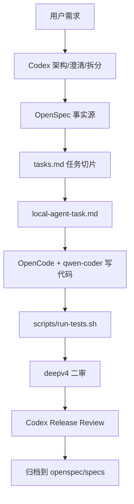
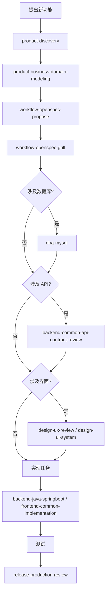
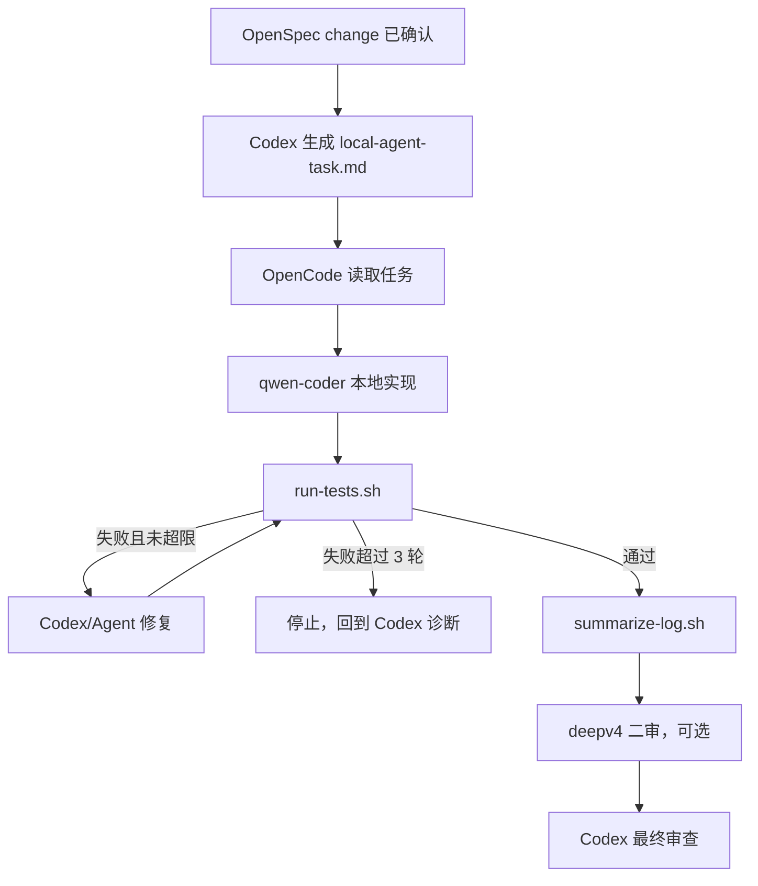
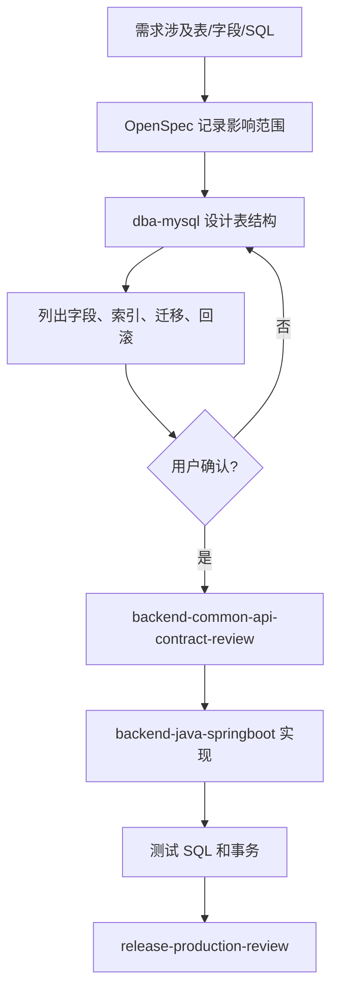
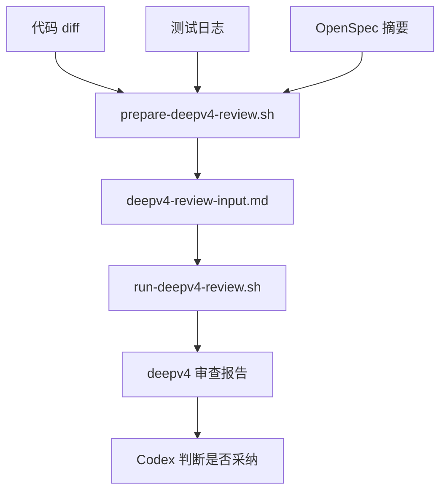
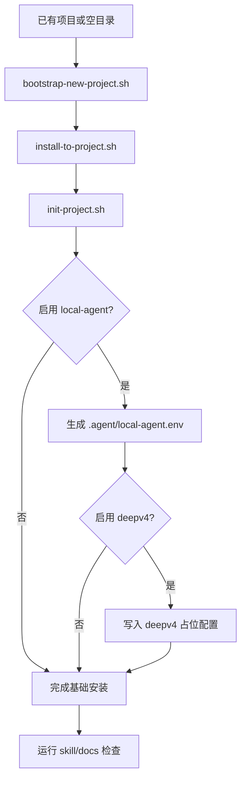

# AI 全栈控制系统流程图

## 总体关系

```mermaid
flowchart TD
  U["用户需求"] --> C["Codex 架构/澄清/拆分"]
  C --> O["OpenSpec 事实源"]
  O --> T["tasks.md 任务切片"]
  T --> L["local-agent-task.md"]
  L --> Q["OpenCode + qwen-coder 写代码"]
  Q --> R["scripts/run-tests.sh"]
  R --> D["deepv4 二审"]
  D --> CR["Codex Release Review"]
  CR --> A["归档到 openspec/specs"]
```

## 新功能流程

```mermaid
flowchart TD
  A["提出新功能"] --> B["product-discovery"]
  B --> C["product-business-domain-modeling"]
  C --> D["workflow-openspec-propose"]
  D --> E["workflow-openspec-grill"]
  E --> F{"涉及数据库?"}
  F -- "是" --> G["dba-mysql"]
  F -- "否" --> H{"涉及 API?"}
  G --> H
  H -- "是" --> I["backend-common-api-contract-review"]
  H -- "否" --> J{"涉及界面?"}
  I --> J
  J -- "是" --> K["design-ux-review / design-ui-system"]
  J -- "否" --> L["实现任务"]
  K --> L
  L --> M["backend-java-springboot / frontend-common-implementation"]
  M --> N["测试"]
  N --> O["release-production-review"]
```

## 本地 Agent 闭环

```mermaid
flowchart TD
  A["OpenSpec change 已确认"] --> B["Codex 生成 local-agent-task.md"]
  B --> C["OpenCode 读取任务"]
  C --> D["qwen-coder 本地实现"]
  D --> E["run-tests.sh"]
  E -- "失败且未超限" --> F["Codex/Agent 修复"]
  F --> E
  E -- "失败超过 3 轮" --> G["停止，回到 Codex 诊断"]
  E -- "通过" --> H["summarize-log.sh"]
  H --> I["deepv4 二审，可选"]
  I --> J["Codex 最终审查"]
```

## 数据库变更流程

```mermaid
flowchart TD
  A["需求涉及表/字段/SQL"] --> B["OpenSpec 记录影响范围"]
  B --> C["dba-mysql 设计表结构"]
  C --> D["列出字段、索引、迁移、回滚"]
  D --> E{"用户确认?"}
  E -- "否" --> C
  E -- "是" --> F["backend-common-api-contract-review"]
  F --> G["backend-java-springboot 实现"]
  G --> H["测试 SQL 和事务"]
  H --> I["release-production-review"]
```

## deepv4 二审流程

```mermaid
flowchart TD
  A["代码 diff"] --> B["prepare-deepv4-review.sh"]
  C["测试日志"] --> B
  D["OpenSpec 摘要"] --> B
  B --> E["deepv4-review-input.md"]
  E --> F["run-deepv4-review.sh"]
  F --> G["deepv4 审查报告"]
  G --> H["Codex 判断是否采纳"]
```

## 新项目接入流程

```mermaid
flowchart TD
  A["已有项目或空目录"] --> B["bootstrap-new-project.sh"]
  B --> C["install-to-project.sh"]
  C --> D["init-project.sh"]
  D --> E{"启用 local-agent?"}
  E -- "是" --> F["生成 .agent/local-agent.env"]
  E -- "否" --> G["完成基础安装"]
  F --> H{"启用 deepv4?"}
  H -- "是" --> I["写入 deepv4 占位配置"]
  H -- "否" --> G
  I --> G
  G --> J["运行 skill/docs 检查"]
```
