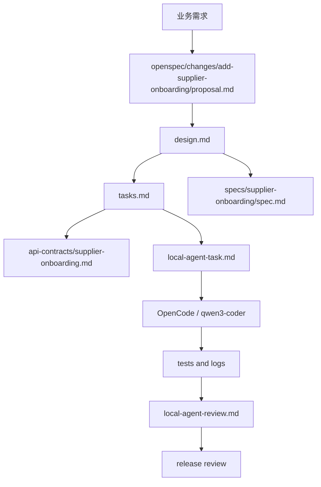

# Supplier Onboarding Example

这是一个端到端学习示例，用来展示 AI 全栈控制系统如何串起需求、规格、接口、任务切片、本地 Agent 执行和审查。

本示例不是业务项目默认规则。字段、状态、接口路径和权限只用于演示，真实项目必须重新确认。

## 文件关系



## 学习顺序

1. 先读 `openspec/changes/add-supplier-onboarding/proposal.md`，看范围如何声明。
2. 再读 `design.md`，看不确定点如何保留为待确认。
3. 读 `tasks.md`，看 DBA、API、后端、前端、测试、审查如何拆分。
4. 读 `api-contracts/supplier-onboarding.md`，看接口契约如何独立于实现确认。
5. 读 `local-agent-task.md`，看 Codex 交给 OpenCode/qwen 的任务边界。
6. 读 `local-agent-review.md`，看本地 Agent 完成后 Codex 如何收口审查。

## 对应命令

```bash
bash scripts/openspec-check.sh examples/supplier-onboarding/openspec/changes/add-supplier-onboarding
bash scripts/route-compliance-check.sh examples/supplier-onboarding/openspec/changes/add-supplier-onboarding
```
